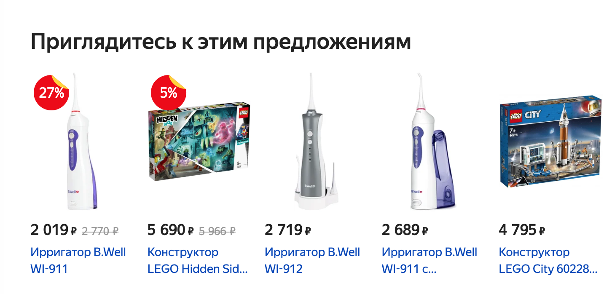

# Redux

---

## [GutHub Pages](https://romanmenshikov92.github.io/ra-16-react-redux/)

Необходимо выполнить и предоставить на проверку следующие задачи:

1. Редактирование

# Редактирование

Этот проект не предполагает взаимодействия по протоколу HTTP и наличия серверной части.

Взяв за основу проект, рассмотренный на лекции, доработайте его либо напишите с нуля:

1. По умолчанию показывается форма добавления, при заполнении и нажатии на кнопку Save происходит добавление элемента в список:

2. При нажатии на кнопку «Редактировать» форма автоматически заполняется данными элемента:

Далее возможны два сценария:

2.1 Если пользователь нажал на кнопку Save, запись в таблице обновляется.

2.2 Если пользователь нажал на кнопку Cancel, то поля вычищаются и снова отображается форма добавления.

Бонусное задание: подумайте, как должно вести себя приложение, если вы при редактировании записи, нажмёте на «Удалить» — крестик.

2. Фильтрация

# Фильтрация

Этот проект не предполагает взаимодействия по протоколу HTTP и наличия серверной части.

Взяв за основу проект, рассмотренный на лекции, или [проект редактирования](./src/components/Editing/), предложите вариант реализации возможности фильтрации: то есть у вас должно быть строковое поле, при введении данных в которое будут отображаться только объекты, у которых название содержит введённую строку.

Предложите собственную реализацию этой функциональности.

Обратите внимание:
1. При пустом значении фильтра должны показываться все объекты.
1. Неважно, заполнен фильтр или нет, все функции редактирования — добавление, обновление, удаление — должны быть доступны.

Напоминаем, что фильтр — это просто текстовое поле.

**Важно**: попробуйте проанализировать существующие системы на предмет того, как это реализовано у них, и на базе этого предложить собственное решение.

3. Маркет (необязательная задача)

# Маркет(Каталог)

Этот проект не предполагает взаимодействия по протоколу HTTP и наличия серверной части.

В этой задаче вы выступите в роли аналитика и проектировщика. На базе существующего сервиса вам самостоятельно необходимо спроектировать и реализовать на базе Redux форму добавления и отображения товаров. Важно: нас интересует только добавление и отображаение*.

Примечание*: редактирование и удаление делать не нужно.

Задача: разработайте на базе Redux форму добавления и отображения товаров как в Яндекс.Маркете.

Обратите внимание: на базе примера с лекции вы должны сами выступить в роли проектировщика и решить, какие поля и в каком виде — строка, число, boolean — вы будете хранить.

Задача вашего приложения — проектирование формы добавления и реализация списка для отображения:

Скриншот сервиса [Яндекс.Маркет](https://market.yandex.ru/).

---

Первые два задания лучше сдавать в одном проекте, то есть в одном create-react-app, так как второе задание продолжает идеи первого.

Любые вопросы по решению задач задавайте в группе в Discord.

Все три задачи лучше сдавать в разных репозиториях, то есть через create-react-app реализовать три проекта, чтобы не было конфликта стилей. Но если вы позаботитесь о том, что конфликта не будет, то можете сдавать и в одном проекте.

Обратите внимание: в файлах App.js расположено несколько компонентов не потому, что так нужно делать, а чтобы вам было удобнее копировать. Будет хорошо, если в своём решении вы разнесёте их по разным файлам.

#### Альтернативный способ создания приложения React с использованием тулинга Vite

Приложение также можно создать используя инструмент Vite.
Документация по созданию приложения [React](https://vitejs.dev/guide/).

1. Откройте терминал и пропишите следующую команду: `yarn create vite my-app --template react`,
   либо `yarn create vite my-app --template react-ts`, если
   нужен шаблон с TypeScript. Эта команда создаст настроенный
   шаблонный проект.
2. Откройте созданный проект в своей IDE.
3. Установите зависимости.
4. Готово. Чтобы запустить приложение, введите команду: `yarn dev`(либо `npm run dev`).
